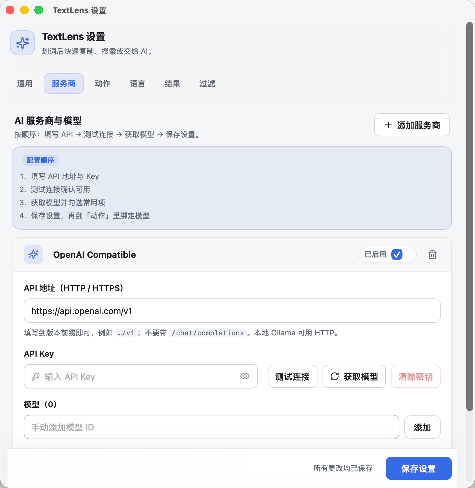
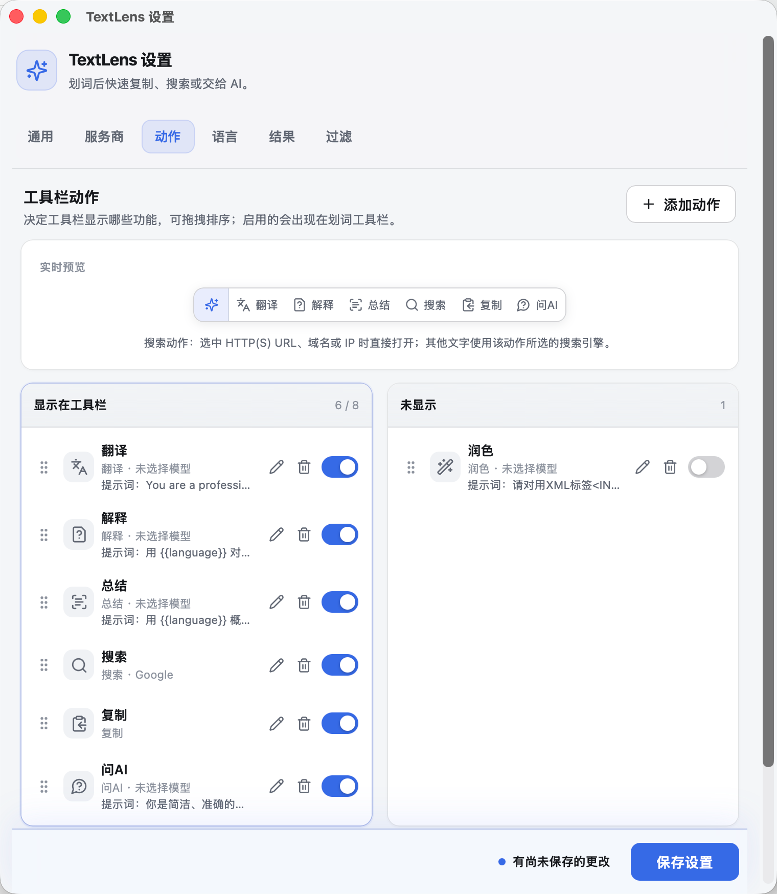
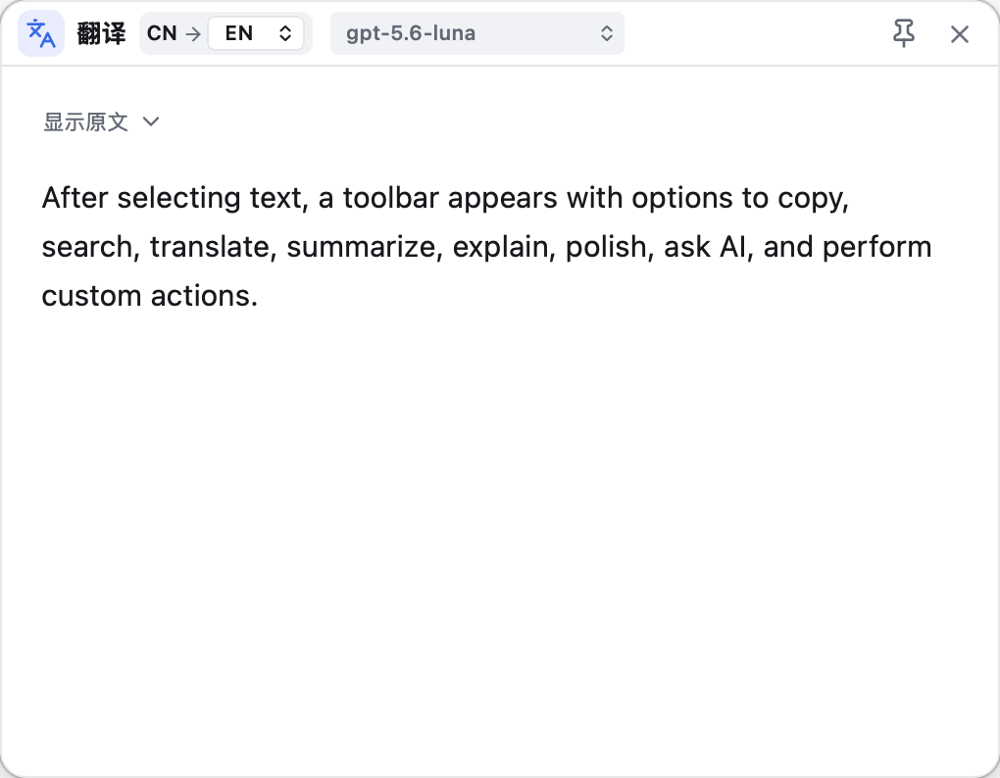

# TextLens

[English](./README.en.md) | **中文**

TextLens 是一个轻量的桌面划词助手，面向 **macOS 12+ Apple Silicon（M 系列芯片）**和 **Windows 10/11 x64**，使用 Tauri 2、Rust、React 和 TypeScript 构建。

用户在其他应用中选中文字后，可以直接执行复制、搜索、翻译、总结、解释、润色、问AI 及自定义 AI 动作。macOS 版本常驻菜单栏，默认不在 Dock 显示；Windows 版本普通启动后在通知区域和后台运行，仅显示短暂的“TextLens 已启动”提示，设置窗口由用户从通知区域打开。TextLens 不保存划词历史，只有用户主动点击 AI 动作后才会把选中文字发送给所配置的模型服务。

两个平台共用 renderer、设置、动作、模型请求、流式输出和数据契约，仅选区捕获、剪贴板、窗口原生属性和系统集成使用平台实现。本地开发、可迁移源码导出与版本演进记录见 [DEVELOPMENT_HANDBOOK.md](./DEVELOPMENT_HANDBOOK.md)。

## 界面预览

### 设置 · AI 服务商与模型

### 设置 · 工具栏动作

### 结果窗口

## 设计灵感与第三方来源

- TextLens 的产品方向和部分交互习惯参考了 [CherryHQ/cherry-studio](https://github.com/CherryHQ/cherry-studio) 的“划词助手”，包括划词工具栏、结果窗、置顶、失焦关闭、再次划词和模型切换等使用逻辑。
- Cherry Studio 主体使用 Electron；TextLens 主要使用更轻量的 Tauri 框架，把其中启发性的“划词助手”工作流重构为独立桌面工具，并保留自己的窗口管理、设置存储、模型请求与界面实现。
- macOS 选区捕获桥接层基于 MIT 许可的 [selection-hook 2.0.2](https://github.com/0xfullex/selection-hook/tree/v2.0.2) 改造，完整 MIT 许可保存在 [LICENSE.selection-hook](./LICENSE.selection-hook)。

TextLens 当前没有声明独立的开源许可证。Cherry Studio 改编材料仍受其上游 AGPL-3.0 条款约束，selection-hook 改编部分仍受 MIT 许可证约束。公开分发或二次开发前，请先阅读第三方许可文件。

## 主要功能

基础能力（划词助手常见工作流）：

- 划词后弹出工具栏：复制、搜索、翻译、总结、解释、润色、问AI 与自定义动作。
- 动作可启停、改名、排序、换图标；支持仅显示图标；搜索可选 Google / Bing / 百度，URL / 域名 / IP 优先直达网页。
- 多服务商、多模型（OpenAI-compatible）；服务商可启停；动作可单独绑定模型与提示词；支持获取模型后多选合并与排序。
- 结果窗流式输出，支持 Markdown / 表格 / 公式；可拖动、缩放、置顶与多种关闭方式；正文可再次划词。

在 Cherry Studio「划词助手」启发之上，TextLens 侧重的增强：

- **结果内继续提问：** 翻译 / 解释 / 总结 / 润色等结果框底部均可继续输入，在当前结果上多轮追问（不只「问AI」）。
- **标题栏换模重生：** 按服务商分组切换模型，并在同一结果框内重新生成；翻译可切换 CN/EN/JA/KO/RU/DE/FR 目标语言。
- **多语言翻译：** 自动检测源语言；默认其他语种→中文、中文→英文；设置页可配置主/备翻译语言对。
- **问AI 会话：** 以划词为上下文打开结果窗，可先不请求模型，再在底部多轮提问；会话仅限当前结果窗。
- **思考与流式：** 支持 thinking / reasoning 流式展示；按模型名自动推断思考档位（含「关闭思考」）；流式输出跟手显示。
- **服务商启停：** 禁用的服务商不出现在动作模型选择与结果窗换模列表（已绑定仍可运行）。
- **轻量与隐私：** 基于 Tauri 的独立划词工具；API Key 本地加密；不保存划词历史，按用户触发的查词、AI 请求或收藏操作发送所需内容。

## 有道查词与欧路生词本

- 内置「翻译」默认对 1–5 个英文词优先查询有道联想和释义，无需有道 API Key 或 AI 模型配置；可在「设置 → 语言」关闭。
- 首尾空白、引号与句读会规范化，词内连字符和撇号保留；长文本、其他语言和自定义动作沿用 AI。短句也可能命中词典。
- 结果框显示音标、释义、词形和最多三条双语例句。查询框输入停顿 250 毫秒后更新联想，回车或点击候选提交查词。点击音标按钮播放发音。
- 没有释义时自动尝试 AI 翻译；网络错误提供重试及「改用 AI 翻译」。配置模型后可携带词条和释义继续追问，词典卡片保留在对话上方。
- 在「设置 → 语言」中保存 [欧路 OpenAPI 完整授权信息](https://my.eudic.net/OpenAPI/Authorization)，查词后点击「加入欧路生词本」，每次选择一个词本并确认。短语整体保存，重复词不会重复添加。
- 有道使用社区记录的 `dict.youdao.com/suggest` 和 `dict.youdao.com/jsonapi` HTTPS 接口，不等同于智云商务 API；接口变化或不可用时会显示错误，每次请求总超时为 10 秒。
- 查词及输入联想会向有道发送当前查询；发音在点击时请求。确认收藏仅向欧路发送当前词条和目标词本，不上传原始选区或例句。欧路授权加密保存，不进入公开设置或日志；不保存查词历史。

## 技术栈

| 层级 | 技术 | 用途 |
| --- | --- | --- |
| 桌面框架 | Tauri 2 | 应用生命周期、菜单栏/通知区、WebView 窗口、IPC、权限和跨平台打包 |
| 原生后端 | Rust 2021 | 选区控制、窗口定位、设置、加密、剪贴板和模型流式请求 |
| macOS 原生桥接 | Objective-C++、Accessibility API、Core Graphics、AppKit | 全局选区、剪贴板兼容捕获和窗口层级 |
| Windows 原生后端 | Rust、UI Automation、Win32、OLE、低级输入钩子 | 隔离式选区捕获、剪贴板恢复、Hook 自愈、非激活窗口、混合 DPI 和单实例 |
| 前端 | React 19、TypeScript 5.9 | 设置页、工具栏和结果窗 |
| 构建工具 | Vite 7、pnpm 11、Cargo | Web 前端构建、依赖锁定和 Rust 编译 |
| 数据校验 | Zod、Serde、serde_json | renderer 与 Rust 之间的数据结构和运行时输入校验 |
| UI 与交互 | Lucide React、dnd kit | 动作图标、自定义图标和拖动排序 |
| Markdown | react-markdown、remark-gfm、remark-math、rehype-katex、KaTeX | 安全 Markdown、表格、列表和数学公式 |
| 网络与流式 | reqwest、Tokio、futures-util | OpenAI-compatible HTTP 请求、SSE 接收、取消和流式缓冲 |
| 本地安全 | ring、base64、原子文件写入 | API Key 的 AES-256-GCM 本地加密与安全落盘 |
| 并发与状态 | parking_lot、tokio-util、UUID | 窗口状态、请求会话和取消控制 |
| 测试 | Vitest、Testing Library、jsdom、Rust tests | 前端状态、交互、数据校验和后端逻辑测试 |
| 发布 | Tauri CLI、DMG、NSIS | 生成 macOS arm64 应用以及 Windows x64 安装包 |

macOS 使用系统自带的 WKWebView；Windows 使用 Microsoft Edge WebView2 Runtime。当前 macOS DMG 和 Windows NSIS 均为未签名测试产物。

## 主要开源项目与用途

以下列表记录直接影响 TextLens 主要功能的上游项目。精确版本以 [pnpm-lock.yaml](./pnpm-lock.yaml) 和 [src-tauri/Cargo.lock](./src-tauri/Cargo.lock) 为准，详细归属说明见 [THIRD_PARTY_NOTICES.md](./THIRD_PARTY_NOTICES.md)。

| 项目 | 用途 | 许可证 |
| --- | --- | --- |
| [Cherry Studio](https://github.com/CherryHQ/cherry-studio) | 交互逻辑参考；部分默认 AI 提示词改编 | AGPL-3.0 |
| [selection-hook 2.0.2](https://github.com/0xfullex/selection-hook/tree/v2.0.2) | macOS 选区捕获桥接层的上游基础 | MIT |
| [Tauri](https://github.com/tauri-apps/tauri) | 跨平台桌面框架、窗口和打包 | Apache-2.0 OR MIT |
| [React](https://github.com/facebook/react) | 用户界面 | MIT |
| [dnd kit](https://github.com/clauderic/dnd-kit) | 设置页动作拖动排序 | MIT |
| [Lucide](https://github.com/lucide-icons/lucide) | 工具栏和设置界面图标 | ISC |
| [react-markdown](https://github.com/remarkjs/react-markdown) | 安全 Markdown 渲染 | MIT |
| [remark-gfm](https://github.com/remarkjs/remark-gfm) | GFM 表格、任务列表等语法 | MIT |
| [remark-math](https://github.com/remarkjs/remark-math) | Markdown 数学公式语法 | MIT |
| [rehype-katex](https://github.com/remarkjs/remark-math/tree/main/packages/rehype-katex) / [KaTeX](https://github.com/KaTeX/KaTeX) | 数学公式渲染 | MIT |
| [Zod](https://github.com/colinhacks/zod) | 前端数据校验 | MIT |
| [reqwest](https://github.com/seanmonstar/reqwest) | OpenAI-compatible HTTP 与 SSE 请求 | MIT OR Apache-2.0 |
| [Tokio](https://github.com/tokio-rs/tokio) | Rust 异步运行时 | MIT |
| [Serde](https://github.com/serde-rs/serde) | Rust 序列化和反序列化 | MIT OR Apache-2.0 |
| [ring](https://github.com/briansmith/ring) | 本地密钥派生和 AES-256-GCM 加密 | ISC、MIT、OpenSSL |
| [objc2](https://github.com/madsmtm/objc2) | Rust 与 macOS AppKit/Foundation 交互 | MIT |
| [macos-accessibility-client](https://codeberg.org/fresskoma/macos-accessibility-client) | macOS 辅助功能权限检查 | Apache-2.0 |
| [windows-rs](https://github.com/microsoft/windows-rs) | Windows UI Automation、窗口、输入、剪贴板和 OLE 接口 | MIT OR Apache-2.0 |
| [Vite](https://github.com/vitejs/vite) / [Vitest](https://github.com/vitest-dev/vitest) | 前端构建和测试 | MIT |
| [TypeScript](https://github.com/microsoft/TypeScript) | 类型系统和编译器 | Apache-2.0 |

这些项目还会引入各自的传递依赖。正式公开发布前，应从两个锁文件生成完整依赖清单并复核所有许可证和版权通知。

## 架构与数据流

1. 平台选区后端监听全局鼠标、键盘和滚轮事件；macOS 使用 Accessibility/Event Tap，Windows 使用 UI Automation/低级输入钩子。Windows 为每个 Hook 实例分配 token，只在实例异常退出或被确认替换时安装新实例，避免周期性盲重装。
2. Windows 将可能被第三方 provider 阻塞的 UIA/OLE 捕获放在同一可执行文件启动的内部 helper 进程中；helper 超时、崩溃或协议异常时会被隔离并重建，不会占满主进程捕获线程。
3. 标准接口无法读取允许兼容的自绘应用时，平台后端临时触发复制；仅在剪贴板没有被再次修改时恢复完整原内容。
4. Rust 运行时验证选区并计算工具栏位置。
5. 用户点击动作后，翻译按文本路由至有道词典或 AI 服务；查词和 AI 共用结果会话，其余动作沿用原有处理。
6. reqwest 接收 OpenAI-compatible Chat Completions 的 SSE 数据；首 token 后每个 content delta 立即下发到结果窗口（不再为 TTFB 做额外合并）。
7. 结果窗同步直通显示流式增量；完成后切换到安全 Markdown 和 KaTeX 渲染。
8. 设置和服务商信息保存在本地 JSON；API Key 加密后单独落盘。常规设置载荷只暴露 `keyConfigured`；设置窗口可在用户点击显示时通过 settings-only IPC 查看或编辑明文，工具栏与结果窗不能读取密钥。

主要目录：

- apps：平台专属源码入口目录，采用“共享核心 + 薄平台层”的组织方式；具体拆分说明见 [apps/README.md](./apps/README.md)。
- apps/macos：macOS 原生选区桥接、macOS 图标与 macOS 产物校验脚本。
- apps/windows：Windows 选区实现、Windows 启动提示 renderer、Windows 图标与 Windows 产物校验脚本。
- src-tauri/src：应用生命周期、窗口、菜单栏、权限、设置、本地加密、选区捕获和模型请求。
- src/shared：数据契约、默认设置、动作、提示词和 URL/IP 识别。
- src/renderer/toolbar：划词工具栏。
- src/renderer/result：AI 结果窗、流式播放和 Markdown。
- src/renderer/settings：服务商、模型、动作和窗口行为设置。
- src/renderer/startup：Windows 启动提示的构建入口 shim，实际实现位于 `apps/windows/renderer/startup`。
- assets 与 src-tauri/icons：共享资源，以及未拆分到平台目录的通用/移动端图标。

## 隐私与安全

- 用户触发查词后向有道发送查询，触发 AI 翻译或追问时向配置的模型发送内容；未命中的查词会自动尝试 AI。欧路写入仅在用户确认收藏时发生。不建立会话历史，不保存划词历史。
- AI 文本默认上限为 20,000 字符，超出时明确提示，不会静默截断。
- 常规设置载荷（`get_settings` / `PublicSettings`）只包含 `keyConfigured`，不包含 API Key 明文；设置 JSON 落盘也不存明文密钥。
- 设置窗口可通过 settings-only IPC（`get_provider_api_key`）在用户**点击显示**时查看或编辑已保存的 API Key；工具栏与结果窗不能调用该命令。
- API Key 使用 AES-256-GCM 加密后保存在本地，不访问 macOS 钥匙串或 Windows 凭据管理器。
- 所有网页窗口使用 context isolation 对应的 Tauri 隔离模型、严格 CSP 和最小 capability。
- Markdown 不启用原始 HTML；脚本、事件属性、危险协议和远程图片不会被直接执行。
- 外链只允许 HTTP 和 HTTPS，日志不应记录 API Key 或选中文本。
- OpenAI-compatible 服务地址支持 HTTP 和 HTTPS。HTTP 会使 API Key 和内容在网络中以未加密方式传输，只建议用于本机或可信局域网；其他场景应使用 HTTPS。
- 服务地址需要包含版本前缀，例如 https://api.openai.com/v1，但不要包含 /chat/completions。连接测试访问 {baseUrl}/models，正式动作访问 {baseUrl}/chat/completions。

## 安装 - Windows

当前 Windows 版本面向 Windows 10/11 x64，使用标准用户权限和 current-user NSIS 安装，不要求管理员权限。

1. 运行生成的 NSIS 安装包；如果系统没有 WebView2 Runtime，安装程序会自动拉起 bootstrapper。
2. 未签名测试包可能触发 Microsoft Defender SmartScreen，可在确认 SHA-256 后选择“更多信息 → 仍要运行”。
3. 首次启动后应用会常驻通知区域，不会自动打开设置页；设置窗口由通知区域菜单打开。
4. 点击设置窗口 X 默认隐藏到通知区域；可在设置中改为直接退出。完整退出可使用通知区域菜单的“退出 TextLens”。
5. TextLens 不提权，因此无法读取“以管理员身份运行”的高权限应用选区；普通权限应用不受此限制。

当前 Windows 安装包仍是未签名测试版，可能触发 Microsoft Defender SmartScreen；自动化验证不能替代不同应用、权限和 DPI 环境下的实机验收，不适合在完成代码签名和完整兼容性验收前公开分发。

## 安装 - macOS

当前只发布 Apple Silicon 版本，不能在 Intel Mac 上运行。

1. 打开生成的 DMG，将 TextLens 拖到“应用程序”。
2. 安装新版本前，先从菜单栏彻底退出正在运行的旧版 TextLens；新版本默认作为菜单栏工具运行，不在 Dock 显示。
3. 首次启动若被 Gatekeeper 拦截，在 Finder 中右键 TextLens 并选择“打开”；也可以到“系统设置 → 隐私与安全性”确认打开。
4. 按提示到“系统设置 → 隐私与安全性 → 辅助功能”启用 TextLens，然后重新启动应用。

当前 macOS DMG 仍是未签名、未公证的测试产物，不适合直接公开分发。正式发布前仍需 Apple Developer ID 签名和公证。

## 第三方许可与发布检查

分发源码或二进制时，至少必须保留：

- [THIRD_PARTY_NOTICES.md](./THIRD_PARTY_NOTICES.md)
- [LICENSE.selection-hook](./LICENSE.selection-hook)
- 上游项目许可证要求的版权和许可文本

TextLens 当前未声明开源许可证，也没有完成 Apple Developer ID、Windows Authenticode 签名、公证或自动更新。正式公开发布之前，还应完成完整的依赖许可证清单、安全复核、签名、公证和安装验收。

## 友链

- [LINUX DO](https://linux.do) - 学AI，上L站！
